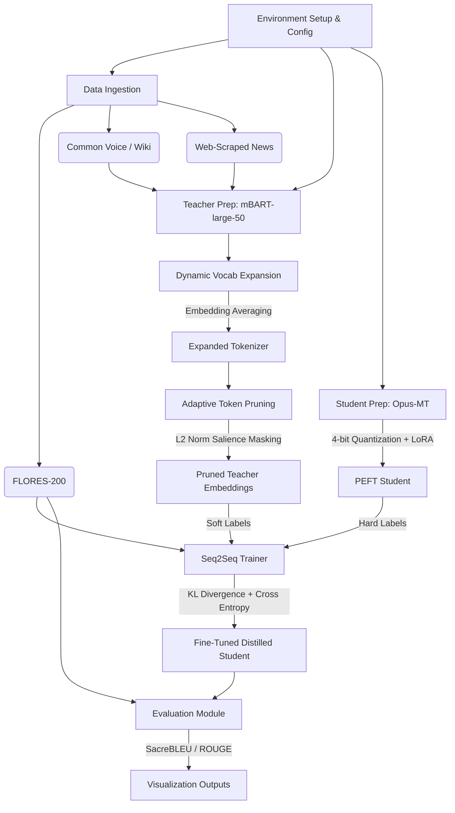

# NLP Project Architecture & Analysis
**Project:** Adaptive Token Pruning: Boosting Cross-Lingual Transfer in Low-Resources

This document provides a comprehensive structural breakdown of the entire codebase based on the `NLP_Project.ipynb` implementation.

## 1. Directory Structure

```text
d:\MyStuff\OtherStuff\NLP\NLP_Project\Adaptive-Token-Pruning-Boosting-Cross-Lingual\
│
├── NLP_Project.ipynb              # Main execution pipeline (End-to-End Implementation)
├── requirements.txt               # Project dependencies (PyTorch, HF Transformers, etc.)
├── .env                           # Environment variables (e.g., HF_TOKEN)
├── 22i0576_22i2146_NLP_Research_Project.pdf # Project Report/Paper
├── AccessTokens.txt               # API Keys / Access tokens
│
├── data/                          # Datasets directory
│   └── urdu_news.jsonl            # Web-scraped Urdu news corpus for domain adaptation
│
├── models/                        # Saved models and tokenizers
│   ├── student_distilled/         # Fine-tuned & distilled student model (Opus-MT)
│   └── teacher_expanded_tokenizer/# mBART tokenizer with dynamically added Urdu tokens
│
└── outputs/                       # Generated evaluation plots and logs
    ├── ablation_bleu.png          # BLEU score comparisons
    ├── evaluation_results.png     # General evaluation metrics
    ├── model_size_comparison.png  # Parameter size vs performance
    ├── pruning_stats.png          # Token retention/pruning statistics
    ├── throughput_comparison.png  # Inference speed comparisons
    └── training_curves.png        # KD Loss and Cross-Entropy loss curves
```

## 2. Component Structure Breakdown

The monolith notebook is logically divided into 6 heavily decoupled architectural components:

### A. Configuration & Environment Component
*   **Purpose:** Centralizes all hyperparameters, device mappings, and model selections.
*   **Details:** Uses a `@dataclass Config` object.
*   **Key Parameters:** Teacher (`facebook/mbart-large-50-many-to-many-mmt`), Student (`Helsinki-NLP/opus-mt-en-ur`), Pruning threshold (0.1), Distillation Temperature (4.0).

### B. Data Ingestion & Processing Component
*   **Purpose:** Acquires, cleans, and formats multilingual datasets.
*   **Sub-modules:**
    *   **Evaluation Loader:** Loads `FLORES-200` via Hugging Face (`openlanguagedata/flores_plus`).
    *   **Text Corpus Loader:** Mines Wikipedia, CC-100, or OPUS-100 for high-quality Urdu text.
    *   **Web Scraper:** Uses `BeautifulSoup` to scrape live RSS feeds (BBC Urdu, Dawn) and dumps to `urdu_news.jsonl`.

### C. Teacher Preparation & Dynamic Vocab Expansion Component
*   **Purpose:** Prepares the massive Teacher model and adapts it to the target low-resource language (Urdu).
*   **Mechanism:** 
    *   Mines Out-Of-Vocabulary (OOV) tokens from the scraped text corpus.
    *   Finds tokens split into multiple sub-words.
    *   Expands the tokenizer and initializes new embeddings using **Embedding-Averaging** (averaging the existing sub-token vectors).

### D. Adaptive Token Pruning Component
*   **Purpose:** Accelerates inference and training by masking out "low-salience" tokens.
*   **Mechanism:**
    *   `AdaptiveTokenPruner (nn.Module)`: Wraps the encoder.
    *   Calculates token *salience* using the L2 norm of the token embeddings scaled by the attention mask.
    *   Soft-prunes tokens (zeros out their attention mask) that fall below the 10% threshold or exceed the 20% max-pruning ratio.

### E. Quantization & Knowledge Distillation (KD) Component
*   **Purpose:** Transfers knowledge from the 610M parameter pruned teacher to the 74M parameter student efficiently.
*   **Mechanism:**
    *   **Quantization:** Uses `bitsandbytes` to load models in 4-bit (NF4) precision.
    *   **KD Trainer:** Implements `Pivot-Shadow Knowledge Distillation`. Uses a custom objective function combining standard Cross-Entropy loss with Kullback-Leibler (KL) Divergence loss over the teacher's soft targets.
    *   **PEFT/LoRA:** Attaches Low-Rank Adapters to the student model to prevent catastrophic forgetting and reduce VRAM usage.

### F. Evaluation & Visualization Component
*   **Purpose:** Validates the pipeline using standard NLP metrics.
*   **Metrics Engine:** Uses `sacrebleu`, `rouge`, and `evaluate`.
*   **Visualizer:** Generates throughput, ablation, and loss curves using `matplotlib` and `seaborn`.

## 3. Dependency & Execution Graph



## 4. Key Algorithmic Innovations Discovered
1. **Embedding-Averaging Initialization:** Instead of randomly initializing newly added vocabulary tokens for Urdu, the system calculates the mathematical mean of their constituent sub-word embeddings. This allows the teacher model to instantly understand the new tokens without full retraining.
2. **Implementation-Agnostic Salience Pruning:** Instead of relying on raw attention scores (which break with Flash Attention or SDPA), the pruning module uses the **L2 norm of the input embeddings** as a proxy for token salience, normalized to `[0, 1]`.
3. **Soft Pruning via Masking:** Tokens are not physically removed from the tensor (which would break batching). Instead, their `attention_mask` is flipped to `0`, ensuring the transformer ignores them computationally while maintaining rigid tensor shapes.
